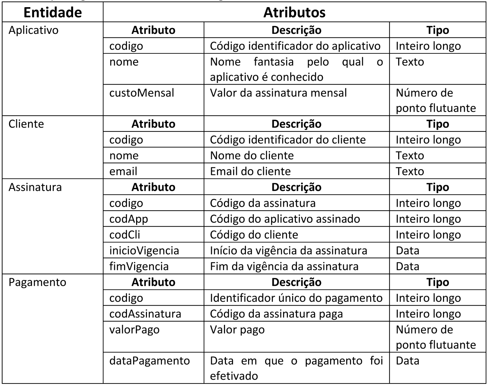
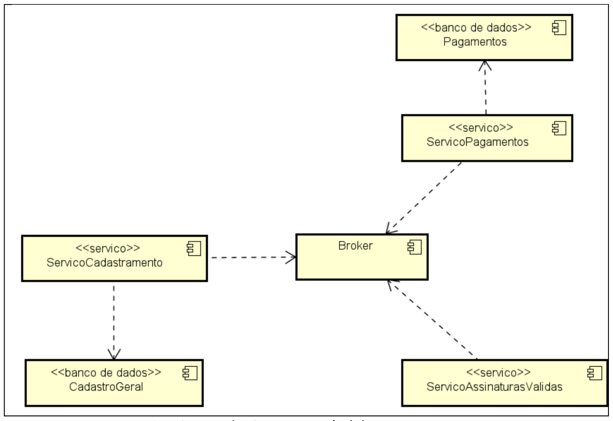

# TODO
- [ ] microsservicos
    - [ ] servico cadastramento
        - [ ] script inicialização
        - [ ] GET /servcad/clientes
        - [ ] GET /servcad/aplicativos
        - [ ] POST /servcad/assinaturas
        - [ ] PATCH /servcad/aplicativos/:idAplicativo
        - [ ] GET /servcad/assinaturas/{tipo}
        - [ ] GET /servcad/asscli/:codcli
        - [ ] GET /servcad/assapp/:codapp
        - [ ] evento: PagamentoServicoCadastramento
    - [ ] servico pagamentos
        - [ ] POST /registrarpagamento
        - [ ] evento: PagamentoServicoCadastramento
        - [ ] evento: PagsmentoServicoAssinaturaValida
    - [ ] servico assinaturas validas
        - [ ] GET /assinvalidas/:codass
        - [ ] evento: PagamentoServicoAssinaturaValida

- [ ] entrega
    - [ ] diagrama entidade-relacionamento banco de dados
    - [ ] diagramas de componentes
    - [ ] diagramas de implantação

    - [ ] passo a passo para implantação do sistema

    - [ ] vídeo demonstrando a execução do sistema em uma plataforma nuvem 

- [ ] fazer deploy dos 3 microsservicos distintos
    - [ ] cadastramento
    - [ ] pagamentos
    - [ ] assinaturas

decidir entre: aws ou azure?
confirmar com o sor se pode ser mongo mas com ids de relação entre eles.... - email ou achamos com ele algum dia?
 

## entidades de domínio

## arquitetura do sistema
